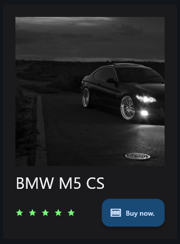

# E-commerce project card &bull; PyCOD3

## Overview
This python script creates a modern e-commerce product card UI component using `Flet` framework, featured product image, title, star rating, and purchase button.



## Installation

```bash
pip install flet
```

## Code structure

### 1. Imports
```python
import flet as ft
```

### 2. Main function setup
```python
def main(page: ft.Page):
    page.title = "ECommerce product card"
```

### 3. Product card container
```python
product = ft.Container(
    content=ft.Column([...]),
    width=350,
    border_radius=5,
    bgcolor="#1A1A1D",
    padding=25
)
```

Property | Value | Description
-|-|-
width | 350 | Fixed width in pixels.
border_radius | 5 | Slightly rounded corners.
bgcolor | #1A1A1D | Dark background color
padding | 25 | Internal spacing

### 4. Card content structure

#### Product image
```python
ft.Image(
    src="product.jpg",
    width=300, height=300
)
```

#### Product title
```python
ft.Text(
    value="BMW M5 CS", 
    size=32, color="#F3F4F6",
    width=300
)
```

#### Rating & purchage row
```python
ft.Row([
    ft.Row([ft.Icon(name=ft.Icons.STAR, color="#77FF77", size=16) for _ in range(5)]),
    ft.FloatingActionButton(text="Buy now.", icon=ft.Icons.MONEY)
], width=350, alignment=ft.MainAxisAlignment.SPACE_BETWEEN)
```

### 5. App initialization
```python
page.add(product)
ft.app(main)
```

## Component details

### Image section
Property | Value | Description
-|-|-
src | "product.jpg" | Product image path
width | 300 | Image width in pixels
height | 300 | Image height in pixels

### Title section
Property | Value | Description
-|-|-
value | "BMW M5 CS" | product name
size | 32 | Large font size
color | "#F3F4F6" | Large gray text color
width | 300 | Fixed width

### Rating stars
- Dynamically creates 5 star icons using list comprehension
- Green color (#77FF77)
- Small size (16px)

### Purchase button
Property | Value | Description
-|-|-
text | "Buy now." | button label
icon | ft.Icons.MONEY | Currency symbol icon